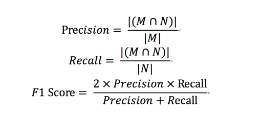

2018中国高校计算机大赛——大数据挑战赛

## **赛题描述**

​      本次大赛基于脱敏和采样后的数据信息，预测未来一段时间活跃的用户。参赛队伍需要设计相应的算法进行数据分析和处理，比赛结果按照指定的评价指标使用在线评测数据进行评测和排名，得分最优者获胜。

## **数据说明**

​      大赛提供脱敏和采样后用户行为数据，日期信息进行统一编号，第一天编号为 01， 第二天为 02， 以此类推，所有文件中列使用 tab 分割。

1.注册日志

| 列名          | 类型   | 说明                   | 示例          |
| ------------- | ------ | ---------------------- | ------------- |
| user_id       | Int    | 用户唯一标识（脱敏后） | 666           |
| register_day  | String | 日期                   | 01, 02 ..  30 |
| register_type | Int    | 来源渠道（脱敏后）     | 0             |
| device type   | Int    | 设备类型（脱敏后）     | 0             |

2.APP 启动日志

| 列名    | 类型   | 说明                   | 示例        |
| ------- | ------ | ---------------------- | ----------- |
| user_id | Int    | 用户唯一标识（脱敏后） | 666         |
| day     | String | 日期                   | 01, 02 ..30 |

3.拍摄日志（video_create_log.txt）

|    列名 | 类型   | 说明                   | 示例         |
| ------: | ------ | ---------------------- | ------------ |
| user_id | Int    | 用户唯一标识（脱敏后） | 666          |
|     day | String | 拍摄日期               | 01, 02 .. 30 |

4.行为日志

| 列名        | 类型   | 说明                                                         | 示例        |
| ----------- | ------ | ------------------------------------------------------------ | ----------- |
| user_id     | Int    | 用户唯一标识（脱敏后）                                       | 666         |
| day         | String | 日期                                                         | 01, 02 ..30 |
| page        | Int    | 行为发生的页面。每个数字分别对应“关注页”、”个人主页“、 ”发现页“、”同城页“或”其他页“中的一个 | 1           |
| video_id    | Int    | video id（脱敏后）                                           | 333         |
| author_id   | Int    | 作者 id（脱敏后）                                            | 999         |
| action_type | Int    | 用户行为类型。每个数字分别对应“播放“、”关注“、  			”点赞“、”转发“、”举报“和”减少此类作品“中的一个 | 1           |

## 评审说明

​      我们将“在未来7天（即第31天至第37天）内使用过APP（在上述任一类型日志中出现过）的用户定义为“活跃用户”，参赛选手需要从“注册日志”中预测出这些用户。

​      提交结果格式为：

| 列名    | 类型 | 说明         | 示例 |
| ------- | ---- | ------------ | ---- |
| user_id | Int  | 用户唯一标识 | 666  |

​      要求每行一个 user_id，user_id 需要从提供给的“注册日志”中选取。

初赛

​      设参赛选手提交的用户集合为 M，实际上未来 7 天内使用过快手的用户集合为 N ，且集合 N 是提供给选手的注册用户的子集。

​      选手提交结果的 F1 Score 定义为：

     

​      最终使用 F1 Score 作为参赛选手得分。F1 Score 越大，代表结果越优，排名越靠前。

​    复赛

​     为了提升复赛中选手成绩的区分度，复赛的评测指标改为AUC。

## 解决方案

初赛评价指标F1

和队友融合A榜达到0.822788，B榜达到0.81985。

初赛模型一直比较稳，但这也是最后的辉煌了。

没有特别关注阈值，AB榜都一直提交的前25000个。

复赛换了auc一直做不上去，我也不知道为什么，最终28名，很遗憾。

这里就只分享我初赛的方案。

model_4这套方案采用标签不重叠的划窗： 

train1:用户1-9，历史信息1-9，标签10-16； 

 train2:用户1-16，历史信息8-16，标签17-23； 

train3:用户1-23，历史信息15-23，标签24-30；

  test:用户1-30，历史信息22-30。

 model_2这套方案采用划窗 

train1:用户1-19，历史信息1-19，标签20-26

 train2:用户1-20，历史信息2-20，标签21-27 

train3:用户1-21，历史信息3-21，标签22-28 

train4:用户1-22，历史信息4-22，标签23-29 

train5:用户1-23，历史信息5-23，标签24-30 

test:用户1-30，历史信息12-30

特征工程不同

队友开源：<https://github.com/FNo0/2018-KUAISHOU-Top28> 这个比赛我们一共四个模型

方案整理的不够详细，如果有什么疑问，可以按照github上邮箱进行联系972913434@qq.com

